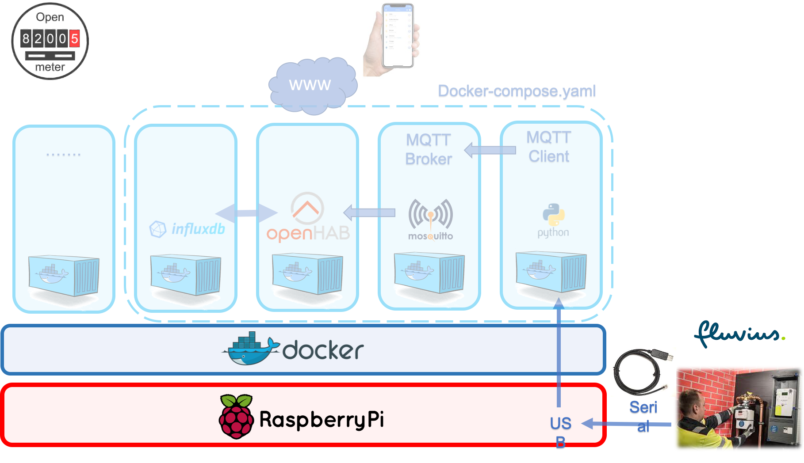
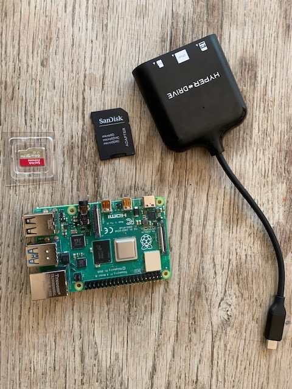
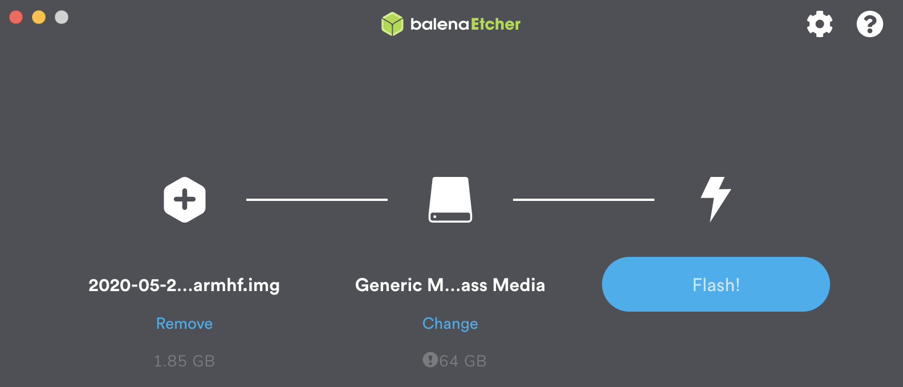
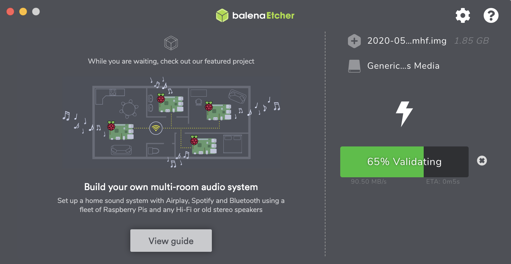
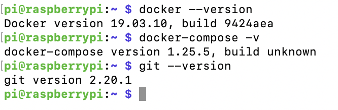
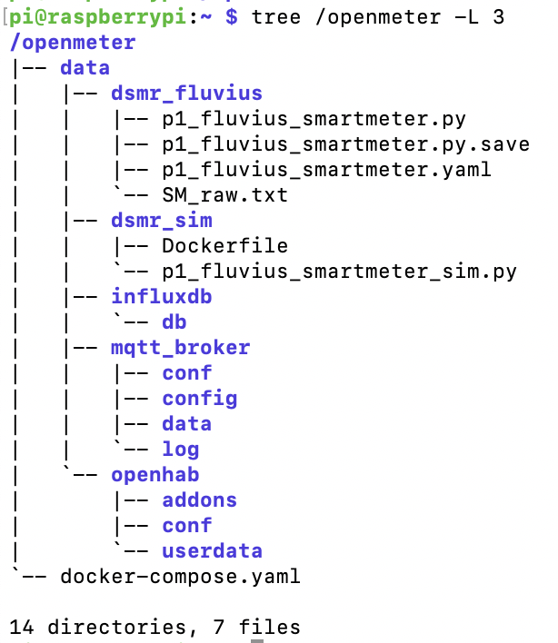

# 1. Intro and goal:

The goal of this repo is to prepare a raspberrypi for the openmeter project. 

We will prepare a RaspberryPi, or RPI, in "headless" mode. This simply means that we will not connect a display-keyboard-mouse to the RPI but we will configure the RPI to connect directly to our Wifi and then interact/connect to it with ssh from our laptop.


- To get the RaspberryPi ready we will:
    - burn the SD card with the OS (Operating System)
        - configure a file on SD card for wifi with network-SSID + password
        - configure the SD card so the RPI will accept ssh
    - Install **docker and docker-compose** on the RPI
    - Install 'git' so we can 'clone' or download the 'openmeter' container configuration later as explained in the "openmeter" repo.

### Summary : RPI + OS + docker + git



 ##   1.1 Hardware:

| What you need | where to buy |
|:--- | :---: |
| Raspberrypi (3B+ or 4)  | [ eg. SOS solutions](https://www.sossolutions.nl/raspberry-pi-4-model-b-4gb)|
| SD card min 16GB | [eg. SOS solutions](https://www.sossolutions.nl/raspberry-pi-4-model-b-4gb) |
| USB to serial cable | [eg. SOS solutions](https://www.sossolutions.nl/slimme-meter-kabel)| 
| wifi - internet available | you :-) |




    1.2 Installation steps - Overview

    * Install Rasperrypi
        * SD card with raspberrypi OS-lite
        * add Wifi user + password
        * add ssh
    * Install Docker + Docker-compose 
    * Install git
    * Install tree
    * run shell script:
        * -> prepare volumes on pi
        * run git clone .... 
    * modify openhab password for cloud mobile app
*********
## Detailed installation steps
# 2. Install RaspberryPI

We will go for a headless install

* **Step 1:** We will [download](https://downloads.raspberrypi.org/raspios_full_armhf_latest) Raspberry Pi OS (32-bit) Lite (formerly known as Raspbian) on your Mac/PC

* **Step 2:** unzip the immage and burn it to SD card
    * you can use [etcher](https://www.balena.io/etcher/) to burn your SD card
    * 
    * 
* **Step 3:** unplug + re-plug your SD card to Mac/PC to make sure you see it as drive on your Mac/PC.
* **Step 4:** Configure Wifi user/pswd on SD card
    * on Mac:
        * open cmd window
        * type: 'touch /Volumes/boot/wpa_supplicant.conf
        * open and edit file below for wifi access -> ssid =... and psk =...
```
country=BE
ctrl_interface=DIR=/var/run/wpa_supplicant GROUP=netdev
update_config=1
network={
    ssid="NETWORK-NAME"
    psk="NETWORK-PASSWORD"
}
```

* **Step 5:** Configure SSH - because default is prohibited
    * on Mac:
        * open cmd window
        * type: 'touch /Volumes/boot/ssh'
            -> this creates a empty ssh file in root of SD card !
    * on PC: 
        * create empty file named 'ssh' and copy it in root
            * ps: make sure that is has one space char!

* **Step 6:** Login to pi for basic update and config
    * from mac: type in cmd window
        * if you know the IP addr:
            * 'ssh pi@192.168.2.90' 
        * if you do not know the IP addr
            * 'ssh-keygen -R raspberrypi.local'
            * 'ssh pi@raspberrypi.local'
    * replace standaard pswd and user:
        * sudo raspi-config
        * ps: you will have to log in again with ssh
            * ssh pi@mypi.local 
                * remark: mypi = new hostname
    * update system:
        * 'sudo update -y'
        * 'sudo upgrade -y'

reference: [setting up raspberrypi](https://desertbot.io/blog/headless-raspberry-pi-4-ssh-wifi-setup)

# 3. Install docker on pi
* Install docker
    * curl -sSL https://get.docker.com | sh
    * Add pi user to run docker commands
        * sudo usermod -aG docker pi
    * sudo reboot
    * install dependencies
        * sudo apt-get install -y libffi-dev libssl-dev
        * sudo apt-get install -y python3 python3-pip
        * sudo apt-get remove python-configparser
* Install docker-compose
    * sudo pip3 install docker-compose
* Install git
    * sudo apt-get install git
* Install tree
    * sudo apt-get install tree
* Prepare a directory on your pi as 'Volume binding'
**ps: improvement doiing it with shell script**
    * on raspberry:

```bash
# todo for later shell script
```

# 4. Final check:

If everything went ok then you should be able to:
- ssh into pi from your pc
- check docker, docker-compose and git versions

```bash
# ssh into pi
ssh pi@192.168.2.2O             -> here use your pi ip address

# check docker
docker --version                -> will return the version (eg:19.03.10)
docker-compose --version        -> will return the version (eg:12.25.5)
git --version                   -> will return the version (eg:2.20.1)
```



## Final Directory structure ready to bind to the docker containers:

```bash
# run the script to create dirs
sh install_openmeter.sh
```

**Remark**: if everything went ok you will get this directory structure but **without content - so No files**"

